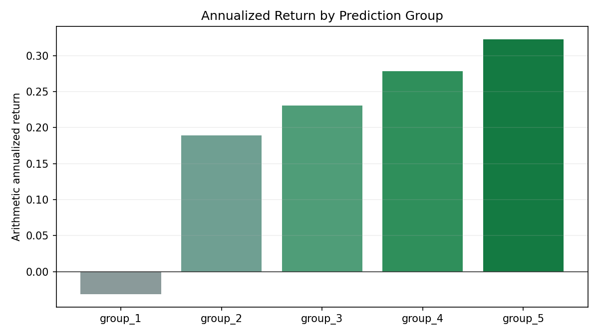
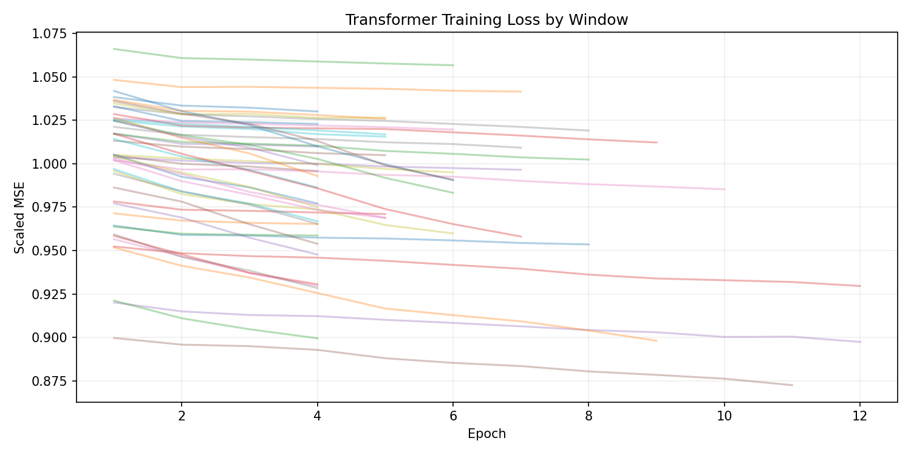
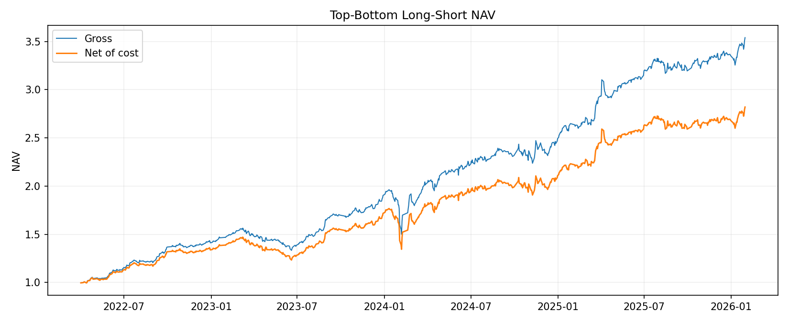
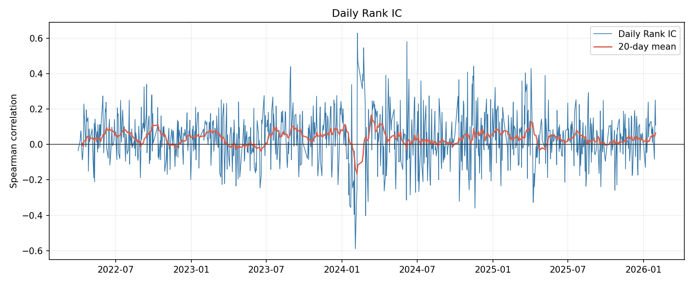

# Pattern-Recognition-cnstock


### Transformer-based A-share Cross-sectional Return Prediction

### 基于 Transformer 的 A 股个股横截面收益预测研究

A leakage-audited quantitative research project for A-share cross-sectional stock return prediction, combining market regime recognition, linear baselines, nonlinear models, and Transformer-based sequence modeling.

本项目是一个经过信息泄漏审计的 A 股个股横截面收益预测研究，结合市场状态识别、线性基线模型、非线性模型与 Transformer 序列建模，评估模型在样本外的排序能力、组合收益和可实现性。

---

## Research Use Statement / 研究用途说明

This repository is for research and educational purposes only. It is not investment advice, not a production trading system, and not a recommendation to trade.

本仓库仅用于研究与学习展示，不构成投资建议，不是生产级交易系统，也不建议据此交易。

Raw market data, licensed datasets, large cache files, and intermediate parquet files are not included due to data licensing, privacy, and storage constraints.

由于数据授权、隐私与文件体积限制，本仓库不包含原始行情数据、授权数据集、大型缓存文件和中间 parquet 文件。

---

## Overview / 项目概述

This project studies A-share cross-sectional stock return prediction under a strict out-of-sample evaluation framework. The research started from a two-stage quantitative pipeline: first identifying market regimes with a Gaussian Hidden Markov Model, then predicting individual stock returns using OLS, Ridge, Kernel Ridge, MLP, and other machine learning models.

The latest V5 version adds a Transformer Encoder sequence model. Instead of using only static cross-sectional features, the Transformer baseline uses each stock's historical 20-trading-observation feature sequence and applies Multi-Head Attention to predict next-day stock returns. The goal is to test whether historical price-volume paths contain useful temporal structure beyond traditional linear and nonlinear baselines.

本项目研究严格样本外框架下的 A 股个股横截面收益预测。项目最初采用两阶段量化研究流程：第一阶段使用 Gaussian HMM 识别市场状态，第二阶段使用 OLS、Ridge、Kernel Ridge、MLP 等模型预测个股未来收益。

最新 V5 版本新增 Transformer Encoder 序列模型。相比只使用静态截面特征，Transformer baseline 使用每只股票过去 20 个交易观测的历史特征序列，并通过 Multi-Head Attention 预测下一交易日收益。核心问题是：历史量价路径中是否存在传统线性模型和普通非线性模型没有充分捕捉到的时序结构。

---

## Project Evolution / 项目迭代说明

This repository represents the latest stage of a continuous research process. V1--V5 are not isolated projects; they are iterative improvements around the same research question:

**Can machine learning models extract stable and implementable cross-sectional return signals from A-share market data?**

本仓库是一个连续迭代研究项目的最新阶段。V1--V5 不是彼此割裂的项目，而是围绕同一个研究问题不断改进：

**机器学习模型能否从 A 股市场数据中提取稳定、可实现的横截面收益信号？**

| Version | Main Idea                                                                                                                                     | 中文说明                                                     |
| ------- | --------------------------------------------------------------------------------------------------------------------------------------------- | -------------------------------------------------------- |
| V1      | Built the initial two-stage framework: Gaussian HMM market regime recognition + OLS / Ridge / Kernel Ridge for future stock return prediction | 建立初始两阶段框架：HMM 市场状态识别 + OLS / Ridge / Kernel Ridge 个股收益预测 |
| V2      | Improved the pipeline with strict lagged features, walk-forward validation, leakage checks, transaction costs, and portfolio diagnostics      | 强化严格滞后特征、walk-forward 样本外验证、信息泄漏检查、交易成本与组合可实现性分析         |
| V3      | Tested HMM state variables in supervised stock return prediction                                                                              | 在监督预测框架下测试 HMM 状态变量的增量作用                                 |
| V4      | Explored multi-scale Transformer and HMM-informed Transformer with 5/20/60-day windows                                                        | 尝试多尺度 Transformer 与 HMM-informed Transformer             |
| V5      | Integrated a Transformer sequence baseline into the stricter V2-style evaluation framework                                                    | 在更严格的 V2 因果评估框架中加入 Transformer 序列模型                      |

The archived materials for V1--V4 are organized under the `experiments/` folder. Raw market data, licensed datasets, cache files, and large intermediate outputs are excluded from this repository.

V1--V4 的归档材料已整理在 `experiments/` 文件夹中。原始行情数据、授权数据集、缓存文件和大型中间结果均未包含在本仓库中。

---

## Key Findings / 核心结果

### 1. Transformer shows positive out-of-sample predictive power

#### Transformer 具有正向样本外预测能力
The V5 Transformer baseline uses a 20-observation historical sequence for each stock and predicts next-day stock returns under a walk-forward evaluation framework.

V5 Transformer baseline 使用每只股票过去 20 个交易观测作为历史序列输入，在 walk-forward 框架下预测下一交易日收益。

| Metric / 指标                                           | Value / 数值 |
| ----------------------------------------------------- | ---------: |
| Valid evaluated rows / 有效评估样本数                        |  4,440,862 |
| Test days / 测试交易日数                                    |        931 |
| Rank IC mean                                          |   0.038227 |
| Rank IC std                                           |   0.142991 |
| ICIR                                                  |   0.267340 |
| IC positive ratio / IC 为正比例                           |     60.47% |
| Direction accuracy / 方向准确率                            |     50.21% |
| MSE                                                   |   0.001129 |
| Top annualized return / Top 组年化收益                     |     32.30% |
| Bottom annualized return / Bottom 组年化收益               |     -3.16% |
| Top-Bottom gross annualized return / Top-Bottom 毛年化收益 |     35.46% |
| Top-Bottom net annualized return / Top-Bottom 扣费后年化收益 |     29.30% |
| Net annualized compound return / 扣费后复合年化收益            |     32.39% |
| Net annualized volatility / 扣费后年化波动率                  |     15.68% |
| Sharpe                                                |   1.869117 |
| Max drawdown / 最大回撤                                   |    -23.90% |
| Mean top turnover / Top 组平均换手率                        |     25.29% |
| Mean bottom turnover / Bottom 组平均换手率                  |     23.45% |

---

### 2. Transformer improves over previous nonlinear baselines

#### Transformer 优于原有普通非线性模型
Compared with Kernel Ridge and a two-layer MLP, the Transformer sequence model shows stronger portfolio-level performance. This suggests that sequence modeling and attention mechanisms can extract useful information from historical price-volume paths.

相较于 Kernel Ridge 和两层全连接 MLP，Transformer 序列模型在组合端表现上有明显提升。这说明历史量价路径中的时序结构具有一定预测价值，Transformer 比普通 MLP 更适合处理这类序列信息。

| Model / 模型           | IC / Rank IC |     ICIR | Net Long-Short Annual Return / 多空净年化 |   Sharpe | Max Drawdown / 最大回撤 |
| -------------------- | -----------: | -------: | -----------------------------------: | -------: | ------------------: |
| Ridge baseline       |     0.062331 | 0.399984 |                               36.96% | 1.997065 |             -29.13% |
| Kernel Ridge         |     0.031812 | 0.296962 |                               15.08% | 1.280519 |             -15.64% |
| Two-layer MLP        |     0.028604 | 0.301691 |                               16.53% | 1.561298 |             -13.26% |
| Transformer baseline |     0.038227 | 0.267340 |                               29.30% | 1.869117 |             -23.90% |

---

### 3. Conclusion

#### 结论
The Transformer baseline achieves positive out-of-sample Rank IC and long-short portfolio return. It improves over the previous nonlinear baselines, including Kernel Ridge and the two-layer MLP. This indicates that sequence modeling and Multi-Head Attention can extract useful information from historical price-volume paths.

At the current stage, the Transformer baseline still does not outperform the strongest Ridge linear baseline. The result suggests that Transformer has meaningful modeling value, but further improvements are needed to fully convert its sequence-modeling capacity into stronger out-of-sample portfolio performance.

Transformer baseline 在样本外获得了正向 Rank IC 和多空组合收益，并且优于原有的 Kernel Ridge 和两层全连接 MLP。这说明序列建模和 Multi-Head Attention 能够从历史量价路径中提取一定的有效信息。

当前阶段，Transformer baseline 尚未超过最强的 Ridge 线性基线。该结果说明 Transformer 具有建模价值，但仍需要进一步优化特征输入、模型结构和组合层信号处理，才能更充分地将序列建模能力转化为更强的样本外组合表现。

---

## Methodology / 方法框架

### Market Regime Recognition / 市场状态识别

The early-stage framework uses a Gaussian Hidden Markov Model to identify latent market regimes from market-level aggregated features. These regimes can be interpreted as different market environments, such as bear, volatile, correction, and bull states.

早期框架使用 Gaussian HMM 从市场层面聚合特征中识别隐藏市场状态。这些状态可以理解为不同 market regimes，例如熊态、震荡态、调整态和牛态。

The purpose of HMM is not only to label the market, but also to provide possible regime-level context for downstream stock return prediction.

HMM 的作用不仅是给市场状态打标签，也可以为后续个股收益预测提供市场环境信息。

---

### Cross-sectional Return Prediction / 个股横截面收益预测

The project evaluates multiple model families:

本项目比较了多类模型：

* Linear models: OLS, Ridge
* Nonlinear models: Kernel Ridge, MLP
* State-aware models: HMM state probability features and interactions
* Sequence models: Transformer Encoder with Multi-Head Attention

The central evaluation target is not only regression accuracy, but also whether the predicted scores can rank stocks cross-sectionally and form stable long-short portfolios.

本项目关注的重点不仅是回归误差，而是预测分数能否在横截面上有效排序股票，并形成稳定的多空组合收益。

---

### Transformer Sequence Model / Transformer 序列模型

The V5 Transformer baseline uses a historical sequence of 20 trading observations for each stock.

V5 Transformer baseline 对每只股票使用过去 20 个交易观测作为输入序列。

Input features:

输入特征包括：

* `return_5d`
* `return_10d`
* `return_20d`
* `turnover_20d_mean`
* `log_neg_market_value`

Model structure:

```text
20-observation feature sequence
        ↓
Transformer Encoder
        ↓
Prediction head
        ↓
Next-day return prediction
```

The Transformer Encoder uses Multi-Head Attention to encode historical sequence information. Different attention heads may focus on different aspects of the price-volume path, such as short-term reversal, medium-term trend, turnover behavior, or size-related effects.

Transformer Encoder 使用 Multi-Head Attention 编码历史序列信息。不同 attention head 可能关注量价路径中的不同模式，例如短期反转、中期趋势、换手率变化或市值相关效应。

---

## Walk-forward Evaluation / 滚动样本外评估

The model is trained and evaluated under a strict walk-forward framework:

```text
504 training days
+ 5 embargo days
+ monthly test window
```

Scaler and winsorization bounds are fitted within each training window only. The test window never participates in feature scaling, hyperparameter selection, model fitting, or calibration.

每个窗口内，标准化参数和 winsorization 边界只在训练集内拟合。测试集不参与特征缩放、超参数选择、模型拟合或参数校准。

This design is used to make the Transformer result comparable with the stricter V2 evaluation framework.

该设计用于保证 Transformer 结果能够与更严格的 V2 评估框架保持可比性。

---

## Look-Ahead Bias and Leakage Controls / 前视偏差与泄漏控制

A major focus of this project is avoiding future information leakage.

本项目非常重视避免未来信息泄漏。

| Control / 控制                         | Purpose / 目的                                                          |
| ------------------------------------ | --------------------------------------------------------------------- |
| Strict lagged features / 严格滞后特征      | Use only information available before the prediction time             |
| Walk-forward validation / 滚动样本外验证    | Avoid using future data for model selection                           |
| Embargo period / Embargo 间隔          | Reduce label overlap and information contamination                    |
| Training-only scaling / 仅训练集标准化      | Fit normalization parameters only on training data                    |
| Training-only winsorization / 仅训练集缩尾 | Fit clipping bounds only inside each training window                  |
| Out-of-sample evaluation / 样本外评估     | Evaluate performance only on unseen future windows                    |
| Transaction cost analysis / 交易成本分析   | Test whether statistical signals survive implementation cost          |
| Turnover diagnostics / 换手率诊断         | Evaluate whether portfolio performance is realistically implementable |

---

## Figures / 图表展示

The main experiment figures are stored in `figures/`.

主要实验图表保存在 `figures/` 文件夹中。

### Annualized Return by Prediction Group / 分组年化收益



The prediction groups show a generally monotonic pattern: the lowest predicted group has negative annualized return, while the highest predicted group has the strongest annualized return.

预测分组收益整体呈现较清晰的单调性：最低预测组年化收益为负，最高预测组年化收益最高，说明模型预测分数具有一定横截面排序能力。

---

### Transformer Training Loss / Transformer 训练损失



Most rolling windows show decreasing training loss, suggesting that the model is learning nontrivial patterns from historical sequences. However, training loss alone is not sufficient evidence of predictive power; the final evaluation must rely on out-of-sample Rank IC and portfolio metrics.

多数滚动窗口中训练 loss 随 epoch 下降，说明模型能够从历史序列中学习到一定规律。但训练损失下降并不等同于样本外有效，最终仍需以 Rank IC 和组合端指标为准。

---

### Top-Bottom Long-Short NAV / 多空净值曲线



The long-short NAV increases over the test period both before and after transaction costs. The gap between gross and net performance shows that turnover and trading costs remain important.

多空净值在测试期内整体上升，且扣费后仍保持正向表现。毛收益与扣费后收益之间存在明显差距，说明换手率和交易成本仍然是影响可实现性的重要因素。

---

### Daily Rank IC / 日度 Rank IC



Daily Rank IC is noisy, but the rolling mean is mostly around or above zero, indicating positive but unstable cross-sectional predictive power.

日度 Rank IC 波动较大，但滚动均值大部分时间位于 0 附近或 0 以上，说明模型整体具有正向但不够稳定的横截面预测能力。

---

## Repository Structure / 仓库结构

```text
.
├── README.md
├── LICENSE
├── .gitignore
├── requirements.txt
├── src/
│   ├── __init__.py
│   ├── config.py
│   ├── metrics.py
│   └── transformer_baseline.py
├── notebooks/
│   └── v5_transformer_baseline.ipynb
├── figures/
│   ├── transformer_1d_group_returns.png
│   ├── transformer_1d_loss_curves.png
│   ├── transformer_1d_nav.png
│   └── transformer_1d_rank_ic.png
├── reports/
│   ├── transformer_1d_summary.md
│   └── Turing_AI.pdf
└── experiments/
    ├── README.md
    ├── v1_hmm_market_state/
    │   ├── notebooks/
    │   ├── figures/
    │   └── reports/
    ├── v2_supervised_prediction/
    │   ├── notebooks/
    │   ├── figures/
    │   └── reports/
    ├── v3_hmm_state_prediction/
    │   ├── notebooks/
    │   ├── figures/
    │   └── reports/
    └── v4_hmm_informed_transformer/
        ├── notebooks/
        ├── figures/
        └── reports/
```

| Path / 路径 | Description / 说明 |
|---|---|
| `README.md` | Main bilingual project documentation and experiment summary. |
| `LICENSE` | MIT License file for the repository code and documentation. |
| `requirements.txt` | Python package requirements for running the notebook. |
| `src/` | Reusable Python source code, including configuration, evaluation metrics, and the Transformer baseline model. |
| `notebooks/` | Main V5 Transformer notebook. |
| `figures/` | V5 Transformer result figures, including group returns, training loss, long-short NAV, and Daily Rank IC. |
| `reports/` | V5 experiment summary and project report. |
| `experiments/` | Archived V1--V4 experiment materials, including notebooks, figures, reports, and high-level summaries. |
| `experiments/v1_hmm_market_state/` | V1 HMM market state recognition experiment. |
| `experiments/v2_supervised_prediction/` | V2 supervised stock return prediction and traditional machine learning experiments. |
| `experiments/v3_hmm_state_prediction/` | V3 HMM state feature and supervised prediction experiments. |
| `experiments/v4_hmm_informed_transformer/` | V4 multi-scale Transformer and HMM-informed Transformer experiments. |
| `.gitignore` | Prevents raw data, cache files, zip files, large intermediate files, and local history files from being uploaded. |

---

## Tech Stack / 技术栈

* Python 3.9+
* NumPy
* pandas
* scikit-learn
* PyTorch
* matplotlib
* Jupyter Notebook
* Git / GitHub

---

## Quick Start / 快速开始

Clone the repository:

```bash
git clone https://github.com/pinzek/Pattern-Recognition-cnstock.git
cd Pattern-Recognition-cnstock
```

Create an environment:

```bash
python -m venv .venv
source .venv/bin/activate      # macOS / Linux
# .venv\Scripts\activate       # Windows
```

Install dependencies:

```bash
pip install -r requirements.txt
```

Open the notebook:

```bash
jupyter notebook notebooks/v5_transformer_baseline.ipynb
```

Note: raw market data and large cache files are not included. To fully reproduce the experiment, users need to prepare the original A-share daily panel and label files under the expected local data path.

注意：本仓库不包含原始行情数据和大型缓存文件。如需完整复现实验，需要自行准备对应的 A 股日频面板数据和标签文件，并放置在本地指定路径下。

---

## Limitations / 局限性

* The current Transformer baseline uses only five basic price-volume features.
* Transformer improves over MLP and Kernel Ridge, but does not yet outperform the Ridge baseline.
* Raw market data are not included, so full reproduction requires access to the original data source.
* Transaction costs and turnover remain important constraints for practical implementation.
* The current version does not yet include HMM state probabilities or technical indicator features in the Transformer input.
* The current implementation is a baseline experiment rather than a production trading system.

当前版本仍有局限：

* Transformer 只使用了五个基础量价特征；
* 模型优于 MLP 和 Kernel Ridge，但尚未超过 Ridge 线性基线；
* 仓库不包含原始数据，完整复现需要用户自行准备数据；
* 换手率和交易成本仍然是策略可实现性的关键约束；
* 当前版本尚未将 HMM 状态概率或技术指标加入 Transformer 输入；
* 当前实现是研究型 baseline 实验，而不是生产级交易系统。

---

## Future Work / 后续方向

Future extensions include:

后续可以继续尝试：

1. Add HMM state probabilities to build an HMM-informed Transformer.
2. Add technical indicators such as MACD, RSI, KDJ, and Bollinger Bands.
3. Apply causal signal smoothing to reduce turnover and improve net performance.
4. Compare one-day and five-day return prediction horizons.
5. Explore multi-frequency input using daily and intraday features.
6. Add size-neutral and industry-neutral diagnostics.
7. Improve the Transformer architecture with regime embeddings, attention bias, or multi-scale sequence inputs.

---

## Reports / 报告

* `reports/transformer_1d_summary.md`: concise experiment summary
* `reports/Turing_AI.pdf`: project report

---

## Author / 作者

| Name / 姓名 | Contribution / 贡献 |
|---|---|
| **Runtian Zhou / 周润天** | Project Contributor / 项目贡献者 |
| **Ziliang Shen / 沈梓梁** | Research Mentor; Quant Researcher, Turing Private Fund / 研究指导；图灵私募基金量化研究员 |

---

## Acknowledgements / 致谢

Data access and research support for this project were provided by **Turing Private Fund Management Co., Ltd.**. The A-share market data used in this research were organized and supported by Turing; raw market data, licensed datasets, large cache files, and intermediate parquet files are proprietary and are not included in this repository.

Special thanks are due to **Mr. Ziliang Shen**, Quant Researcher at **Turing Private Fund**, for his guidance throughout this research project. His suggestions on quantitative research workflow, information leakage control, model evaluation, walk-forward validation, portfolio diagnostics, Git-based collaboration, and project presentation helped shape this project from a notebook-style experiment into a more structured and reproducible research repository.

本项目的数据获取与研究支持由**图灵私募基金管理有限公司**提供。本研究所使用的 A 股市场数据由图灵整理和支持；原始行情数据、授权数据集、大型缓存文件和中间 parquet 文件属于专有数据，不包含在本仓库中。

特别感谢**图灵私募基金量化研究员沈梓梁老师**在本项目中的指导。从量化研究流程、信息泄漏控制、模型评估、walk-forward 样本外验证、组合诊断、Git 协作到项目展示，沈老师都给出了非常具体和系统的建议，帮助本项目从 notebook 形式的实验逐步整理成结构更清晰、结果更可复现的研究型 GitHub 项目。

---

## License / 许可

Released under the [MIT License](LICENSE). Copyright © 2026 Runtian Zhou.

基于 [MIT 许可证](LICENSE) 发布。

*Prioritizing reproducible research, leakage-aware validation, and robust portfolio-level evaluation over headline performance metrics.*

*优先关注可复现研究、信息泄漏控制下的验证流程，以及稳健的组合层评估，而非表面化的绩效指标。*
